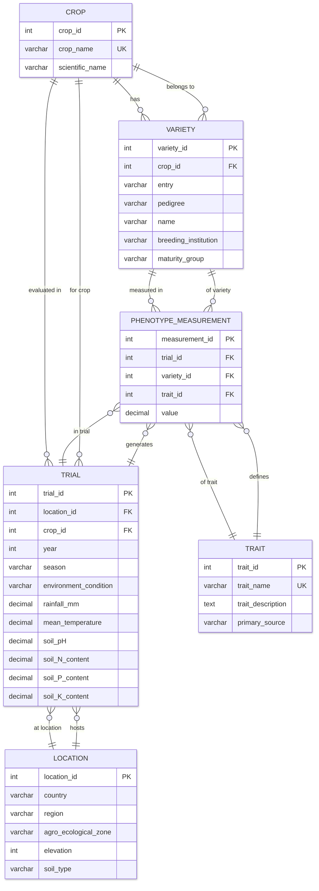

# Crops_MET Data Dictionary

**Database Name:** Crops_MET  
**Version:** 1.1  
**Last Updated:** December 24, 2025  
**Purpose:** Multi-environment trial (MET) phenotypic database for agricultural crop research across multiple varieties, locations, and environmental conditions.

## Table of Contents

1. [Database Overview](#database-overview)
2. [Schema Architecture](#schema-architecture)
3. [Table Definitions](#table-definitions)
4. [Column Specifications](#column-specifications)
5. [Relationships and Constraints](#relationships-and-constraints)
6. [Data Types and Domains](#data-types-and-domains)
7. [Controlled Vocabularies](#controlled-vocabularies)

---

## Database Overview

### Purpose

The Crops_MET database stores comprehensive phenotypic measurements from multi-environment field trials across four major crops: Maize, Rice, Sorghum, and Cowpea. The database supports comparative analysis of crop performance across different environmental conditions, locations, and genetic varieties.

### Data Sources

- **Primary Source:** Consolidated CSV extract from agricultural research institutions
- **Geographic Scope:** Sub-Saharan Africa (Ghana, Nigeria, Kenya, Tanzania, Ethiopia)
- **Temporal Coverage:** 2020-2023
- **Total Records:** 2,771,744 phenotypic measurements from 90,762 experimental observations

### Schema Type

Star schema with:
- **1 Fact Table:** `phenotype_measurement`
- **5 Dimension Tables:** `crop`, `location`, `variety`, `trial`, `trait`
- **1 Staging Table:** `master_crop_table` (retained for data lineage)

---

## Schema Architecture

### Entity Relationship Diagram Summary

### Cardinality Rules

- One crop → Many varieties
- One crop → Many trials
- One location → Many trials
- One variety → Many phenotype measurements (via trial)
- One trait → Many phenotype measurements
- One trial → Many phenotype measurements

### Entity Relationship Mermaid Diagram



---

## Table Definitions

### 1. crop (Dimension Table)

**Purpose:** Defines crop species included in the database.

**Business Rules:**
- Each crop has a unique scientific name
- Crop names follow common agricultural naming conventions
- Scientific names follow binomial nomenclature

**Record Count:** 4

| Column | Data Type | Constraints | Description | Example |
|--------|-----------|-------------|-------------|---------|
| crop_id | INT | PRIMARY KEY, AUTO_INCREMENT | Unique identifier | 1 |
| crop_name | VARCHAR(50) | NOT NULL, UNIQUE | Common name of crop | Maize |
| scientific_name | VARCHAR(150) | NOT NULL | Binomial scientific name | Zea mays |

**Sample Data:**
```
crop_id | crop_name | scientific_name
--------|-----------|------------------
1       | Maize     | Zea mays
2       | Rice      | Oryza sativa
3       | Sorghum   | Sorghum bicolor
4       | Cowpea    | Vigna unguiculata
```

---

### 2. location (Dimension Table)

**Purpose:** Stores geographic and environmental metadata for trial sites.

**Business Rules:**
- Locations are uniquely identified by the combination of country, region, agro-ecological zone, elevation, and soil type
- Elevation measured in meters above sea level
- Soil type follows FAO classification where available

**Record Count:** 17

| Column | Data Type | Constraints | Description | Example |
|--------|-----------|-------------|-------------|---------|
| location_id | INT | PRIMARY KEY, AUTO_INCREMENT | Unique identifier | 1 |
| country | VARCHAR(50) | NOT NULL | Country name | Ghana |
| region | VARCHAR(100) | NOT NULL | Sub-national region/state | Ashanti |
| agro_ecological_zone | VARCHAR(100) | NULL | AEZ classification | Forest-Savanna Transition |
| elevation | INT | NULL | Elevation in meters (masl) | 285 |
| soil_type | VARCHAR(50) | NULL | Soil classification | Sandy loam |

**Sample Data:**
```
location_id | country | region      | agro_ecological_zone       | elevation | soil_type
------------|---------|-------------|----------------------------|-----------|-------------
1           | Ghana   | Ashanti     | Forest-Savanna Transition  | 285.0     | Sandy loam
2           | Nigeria | Omu-Aran    | Southern Guinea Savanna    | 562.0     | Sandy loam
3           | Kenya   | Embu        | Sub-humid                  | 1450.0    | Clay loam
```

**NULL Values:**
- `elevation`: NULL when precise measurement unavailable
- `soil_type`: NULL when classification not performed

---

### 3. variety (Dimension Table)

**Purpose:** Catalog of crop varieties/genotypes tested in trials.

**Business Rules:**
- Each variety belongs to exactly one crop
- Entry codes are standardized internal identifiers
- Breeding institutions may be research centers, universities, or seed companies

**Record Count:** 287

| Column | Data Type | Constraints | Description | Example |
|--------|-----------|-------------|-------------|---------|
| variety_id | INT | PRIMARY KEY, AUTO_INCREMENT | Unique identifier | 1 |
| crop_id | INT | FOREIGN KEY → crop(crop_id) | Associated crop | 1 |
| entry | VARCHAR(100) | NOT NULL | Internal entry code | TZEI-124 |
| pedigree | VARCHAR(255) | NULL | Genetic lineage/parentage | (CML312/CML442)//CML159 |
| name | VARCHAR(255) | NULL | Commercial or research name | ICSV-111 |
| breeding_institution | VARCHAR(150) | NULL | Developing organization | IITA |
| maturity_group | VARCHAR(100) | NULL | Relative maturity classification | Early |

**Sample Data:**
```
variety_id | crop_id | entry    | pedigree         | name      | breeding_institution | maturity_group
-----------|---------|----------|------------------|-----------|---------------------|---------------
1          | 1       | TZEI-124 | NULL             | NULL      | CIMMYT              | Medium
2          | 4       | IT82D-716| NULL             | NULL      | IITA                | Early
```

**NULL Values:**
- `pedigree`: NULL when lineage unknown or proprietary
- `name`: NULL for experimental lines without commercial names
- `breeding_institution`: NULL when source unrecorded
- `maturity_group`: NULL when classification not assigned

---

### 4. trial (Dimension Table)

**Purpose:** Defines experimental trials with environmental and management conditions.

**Business Rules:**
- Each trial occurs at one location in one year/season
- Year stored as 4-digit integer (YYYY format)
- Environment conditions represent management stress levels

**Record Count:** 309

| Column | Data Type | Constraints | Description | Example |
|--------|-----------|-------------|-------------|---------|
| trial_id | INT | PRIMARY KEY, AUTO_INCREMENT | Unique identifier | 1 |
| location_id | INT | FOREIGN KEY → location(location_id) | Trial site | 5 |
| crop_id | INT | FOREIGN KEY → crop(crop_id) | Crop tested | 1 |
| year | INT | NULL | Trial year (YYYY) | 2022 |
| season | VARCHAR(50) | NULL | Growing season | rainy |
| environment_condition | VARCHAR(50) | NULL | Management condition | Optimum |
| rainfall_mm | DECIMAL(10,2) | NULL | Total rainfall (mm) | 850.50 |
| mean_temperature | DECIMAL(10,2) | NULL | Average temperature (°C) | 26.80 |
| soil_pH | DECIMAL(4,2) | NULL | Soil pH | 6.20 |
| soil_N_content | DECIMAL(10,2) | NULL | Nitrogen content (%) | 0.125 |
| soil_P_content | DECIMAL(10,2) | NULL | Phosphorus content (ppm) | 12.50 |
| soil_K_content | DECIMAL(10,2) | NULL | Potassium content (ppm) | 145.00 |

**Sample Data:**
```
trial_id | location_id | crop_id | year | season | environment_condition | rainfall_mm | mean_temperature
---------|-------------|---------|------|--------|-----------------------|-------------|------------------
1        | 2           | 1       | 2022 | rainy  | Optimum               | 950.00      | 24.80
2        | 5           | 1       | 2021 | dry    | Drought               | 450.00      | 28.30
```

**NULL Values:**
- `rainfall_mm`, `mean_temperature`: NULL when weather data not recorded
- `soil_pH`, `soil_N_content`, `soil_P_content`, `soil_K_content`: NULL when soil analysis not performed

---

### 5. trait (Dimension Table)

**Purpose:** Defines phenotypic traits measured in experiments.

**Business Rules:**
- Trait names use standardized nomenclature
- Descriptions reference measurement protocols
- Primary sources indicate ontology/institution origin

**Record Count:** 34

| Column | Data Type | Constraints | Description | Example |
|--------|-----------|-------------|-------------|---------|
| trait_id | INT | PRIMARY KEY, AUTO_INCREMENT | Unique identifier | 1 |
| trait_name | VARCHAR(100) | NOT NULL, UNIQUE | Standardized trait name | grain_yield |
| trait_description | TEXT | NULL | Measurement protocol/definition | Grain weight per plot adjusted to 12.5% moisture content (kg/ha) |
| primary_source | VARCHAR(150) | NULL | Ontology or institutional source | CIMMYT/IBPGR |

**Sample Data:**
```
trait_id | trait_name       | trait_description                                    | primary_source
---------|------------------|------------------------------------------------------|---------------
1        | grain_yield      | Grain weight per plot adjusted to standard moisture | CIMMYT
2        | plant_height     | Distance from soil to highest leaf tip (cm)         | IBPGR
3        | days_to_anthesis | Days from planting to 50% pollen shed               | CROPO_ONT
```

**NULL Values:**
- `trait_description`: NULL when detailed protocol unavailable
- `primary_source`: NULL when origin not documented

---

### 6. phenotype_measurement (Fact Table)

**Purpose:** Stores individual trait measurements from experimental observations.

**Business Rules:**
- Each measurement represents one trait observed on one variety in one trial
- Value is NULL when trait not measured
- Values are numeric; non-numeric traits excluded from this schema

**Record Count:** 2,771,744

| Column | Data Type | Constraints | Description | Example |
|--------|-----------|-------------|-------------|---------|
| measurement_id | INT | PRIMARY KEY, AUTO_INCREMENT | Unique identifier | 1 |
| trial_id | INT | FOREIGN KEY → trial(trial_id), NOT NULL | Associated trial | 15 |
| variety_id | INT | FOREIGN KEY → variety(variety_id), NOT NULL | Measured variety | 47 |
| trait_id | INT | FOREIGN KEY → trait(trait_id), NOT NULL | Measured trait | 5 |
| value | DECIMAL(12,2) | NULL | Measurement value | 3450.50 |

**Sample Data:**
```
measurement_id | trial_id | variety_id | trait_id | value
---------------|----------|------------|----------|--------
1              | 15       | 47         | 5        | 3450.50
2              | 15       | 47         | 8        | 185.00
3              | 15       | 48         | 5        | 3128.75
```

**NULL Values:**
- `value`: NULL when trait not measured.
---

### 7. master_crop_table (Staging Table)

**Purpose:** Retains original denormalized CSV data for data lineage and auditing.

**Business Rules:**
- Preserved exactly as imported from source CSV
- Not used in analytical queries (use normalized tables instead)
- Contains all columns from original dataset in wide format

**Record Count:** 90,762

**Key Columns:**
- `id`: Auto-increment primary key
- `year`, `country`, `region`: Trial metadata
- `crop`, `scientific_name`: Crop identification
- `entry`, `name`: Variety identification
- `days_to_anthesis`, `plant_height`, `grain_yield`, etc.: Trait measurements (56 trait columns)

**Usage Note:** This table is retained for:
- Data provenance tracking
- Debugging data transformation issues
- Regenerating dimension/fact tables if needed

---

## Relationships and Constraints

### Foreign Key Relationships

| Child Table | Child Column | Parent Table | Parent Column | Constraint Name | On Delete |
|-------------|--------------|--------------|---------------|-----------------|-----------|
| variety | crop_id | crop | crop_id | fk_variety_crop | RESTRICT |
| trial | location_id | location | location_id | fk_trial_location | RESTRICT |
| trial | crop_id | crop | crop_id | fk_trial_crop | RESTRICT |
| phenotype_measurement | trial_id | trial | trial_id | fk_pheno_trial | RESTRICT |
| phenotype_measurement | variety_id | variety | variety_id | fk_pheno_variety | RESTRICT |
| phenotype_measurement | trait_id | trait | trait_id | fk_pheno_trait | RESTRICT |

**Referential Integrity:**
- RESTRICT on all foreign keys prevents deletion of referenced records
- Ensures data consistency across related tables

### Indexes

**Primary Indexes:**
- All tables: Primary key auto-indexed

**Foreign Key Indexes:**
- `variety(crop_id)`
- `trial(location_id, crop_id)`
- `phenotype_measurement(trial_id, variety_id, trait_id)`

**Performance Indexes:**
```sql
-- Master table lookups
CREATE INDEX idx_master_entry ON master_crop_table(entry);
CREATE INDEX idx_master_crop ON master_crop_table(crop);
CREATE INDEX idx_master_location ON master_crop_table(country, region, agro_ecological_zone);

-- Dimension table lookups
CREATE INDEX idx_crop_name ON crop(crop_name);
CREATE INDEX idx_trait_name ON trait(trait_name);
CREATE INDEX idx_variety_entry ON variety(entry);
CREATE INDEX idx_location_lookup ON location(country, region, agro_ecological_zone, elevation, soil_type);
CREATE INDEX idx_trial_lookup ON trial(crop_id, location_id, year, season, environment_condition);

-- Fact table analytics
CREATE INDEX idx_pheno_lookup ON phenotype_measurement(variety_id, trial_id, trait_id);
```

---

## Data Types and Domains

### Numeric Types

| Type | Range | Precision | Usage |
|------|-------|-----------|-------|
| INT | -2,147,483,648 to 2,147,483,647 | N/A | IDs, year, counts, elevation |
| DECIMAL(4,2) | -99.99 to 99.99 | 2 decimals | soil_pH |
| DECIMAL(10,2) | Large range | 2 decimals | rainfall_mm, mean_temperature, soil_N_content, soil_P_content, soil_K_content |
| DECIMAL(12,2) | Large range | 2 decimals | Trait measurements |

### String Types

| Type | Max Length | Usage |
|------|------------|-------|
| VARCHAR(50) | 50 chars | crop_name, country, soil_type, season, environment_condition |
| VARCHAR(100) | 100 chars | region, entry, maturity_group, trait_name |
| VARCHAR(150) | 150 chars | scientific_name, breeding_institution, primary_source |
| VARCHAR(255) | 255 chars | pedigree, name |
| TEXT | 65,535 chars | Long descriptions |

---

## Controlled Vocabularies

### crop.crop_name

**Valid Values:**
- Maize
- Rice
- Sorghum
- Cowpea

### location.country

**Valid Values:**
- Ghana
- Nigeria
- Kenya
- Tanzania
- Ethiopia

### trial.season

**Common Values:**
- rainy
- dry


### trial.environment_condition

**Common Values:**
- Optimum (well-managed, no stress)
- Drought (water stress)
- Low N (nitrogen stress)

### trait.trait_name

**Categories:**

**Phenology:**
- days_to_anthesis
- days_to_silking
- anthesis_silking_interval

**Morphology:**
- plant_height
- ear_height
- canopy_height
- leaf_length
- leaf_width
- tillers_per_plant

**Yield Components:**
- grain_yield
- field_weight
- ear_harvested
- ear_per_plant
- seeds_per_plot
- pods_per_plant
- panicle_number

**Grain Quality:**
- grain_moisture
- seed_100_weight
- seed_1000_weight
- grain_covering

**Plant Quality:**
- staygreen
- plant_aspect
- husk_cover
- ear_aspect

**Biomass:**
- dry_matter
- harvest_index
- fodder_yield

---

## Data Quality Notes

### Missing Data Patterns

**Trait Measurements:**

- Crop-specific traits (e.g., ear_height only for Maize) show systematic NULLs

**Environmental Data:**
- Soil chemistry: ~30% NULL (not all sites analyzed)
- Weather data: ~15% NULL (incomplete recording)


## Revision History

| Version | Date | Author | Changes |
|---------|------|--------|---------|
| 1.0 | December 2025 | Database Team | Initial release |

---

**End of Data Dictionary**