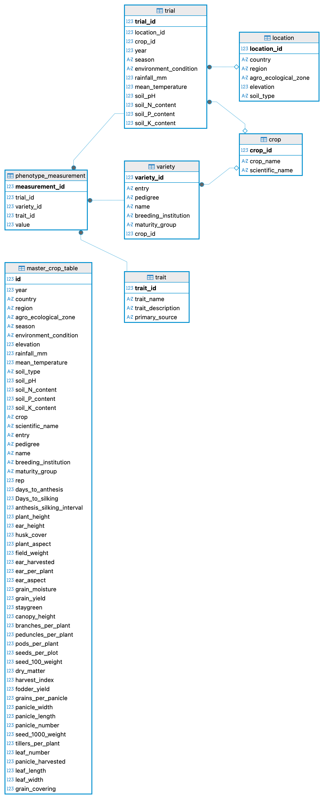

### Project Title and Overview
**Project Title**
Multi-Crop Decision-Support System for Variety Recommendation in Sub-Saharan Africa

**Overview**
The Multi-Crop Decision-Support System (DSS) is a relational database and analytics platform designed to support evidence-based crop variety selection across Sub-Saharan Africa (SSA). The system integrates multi-year, multi-location trial data from five countries (Nigeria, Kenya, Ethiopia, Tanzania, and Ghana) for four major crops; maize, rice, sorghum, and cowpea, to help researchers, breeders, agronomists, and farmers make data-driven decisions.

The database captures information on:

- Crop varieties, including pedigree, breeding institution, and maturity group
- Locations, including country, region, agro-ecological zone, elevation, and soil characteristics
- Trials conducted over multiple years and seasons, under specific environmental conditions
- Phenotypic trait measurements, such as grain yield, plant height, ear height, flowering traits, and other agronomic traits

The system supports advanced data queries for:

- Identifying high-performing varieties across diverse environments
- Evaluating stability and adaptability of varieties across locations and years
- Comparing performance of varieties under drought stress, low nitrogen, and optimum conditions
- Estimating expected yield in different seasons (e.g., dry vs. rainy)
- Analyzing variation in key traits such as days to maturity, plant height, anthesis–silking interval (ASI), and stay-green across environments
- Identifying breeding institutions that develop the best-performing varieties
- Determining the most suitable locations for cultivating specific crop varieties
- Examining year-to-year trends in major agronomic traits
- Supporting evidence-based breeding and agronomic decision-making

### Data Set Metadata
##### 2.1 Description of the Dataset
The dataset used in this project originates from multi-environment crop performance trials conducted across five African countries: Nigeria, Kenya, Ethiopia, Tanzania, and Ghana. The trials cover four major crops: maize, rice, sorghum, and cowpea.
The primary datasets were obtained from:
1. University of Ilorin, Nigeria
2. Institute for Agricultural Research (IAR), Ahmadu Bello University, Zaria
3. International Institute of Tropical Agriculture (IITA)

For countries or locations where data were incomplete or unavailable, additional datasets were simulated to maintain consistency across the database. Environmental data were obtained from the official environmental agencies of each respective country for each trial year.

##### 2.2 Structure of the Database

The relational database is organized into six core entities:

**1. Crop**: Stores information about the different crops included in the system.

**2. Location**: Represents geographical trial sites across countries and regions. It includes fields such as region, country, agroecological zone, elevation and soil type.

**3.Variety**: Contains detailed information on each crop variety evaluated in trials. It includes entry, pedigree, name, breeding institution, and maturity group of the variety.

**4. Trial**: Stores metadata about each experimental trial conducted in a particular year, season, and environment. it includes year, season, environment_condition, rainfall_mm, mean_temperature, soil_pH, soil_N_content, soil_P_content and soil_K_content

**5. Trait**: Defines phenotypic traits measured across trials. It includes traitname, traitdescription and primary source of the description

**6.Phenotype Measurement**:Contains the actual measured values collected from trials.Stores trait values for each variety under a specific trial.It is the core table for analytics, almost all performance queries read from this table. NULL values in the table represent unmeasured traits for a given variety or trial.

######2.3 Data Volume Summary
- Rice
The dataset for rice consists of data obtained from MET of 60 varieties evaluated across multiple regions in three countries: Kenya (Kiboko, Kitale, and Nairobi), Ghana (Damongo, Nyankpale, and Yendi), and Nigeria (Ibadan, Ilorin, Mokwa, Zaria, and Omu-Aran). All rice trials were conducted exclusively under Optimum environmental conditions. The dataset covers a three-year period from 2020 to 2022.

- Maize
Data for maize comes from MET of 237 varieties across four maturity groups: early, extra-early, intermediate, and late. Trials were conducted across five locations in Nigeria (Ibadan, Ilorin, Mokwa, Zaria, and Omu-Aran) and three locations each in Kenya (Kiboko, Kitale, and Nairobi), Ethiopia (Bako, Hawassa, and Melkassa), Ghana (Damongo, Nyankpale, and Yendi), and Tanzania (Arusha, Morogoro, and Dodoma) from 2020 to 2022. Trials were conducted under three key environmental conditions: Low-Nitrogen, Drought, and Optimum.

- Cowpea
The cowpea dataset comprises MET data of 50 varieties evaluated across three locations in Ghana and five locations in Nigeria (same locations as for maize) in 2020, 2021, and 2022. All cowpea trials were conducted exclusively under Optimum environmental conditions.

- Sorghum
The sorghum dataset comprises 60 varieties evaluated across four countries. Trials were conducted in Ghana (Damongo, Nyankpale, Yendi), Kenya (Kiboko, Kitale, Nairobi), Tanzania (Arusha, Morogoro, Dodoma), and Nigeria (Ibadan, Omu-Aran). Sorghum was tested under three environmental conditions: Low-N, Drought, and Optimum. The dataset covers a three-year period (2020–2022).

###### 2.4 Data Cleaning and Processing
Before integration into the database, the raw datasets underwent rigorous cleaning and transformation using both Excel and OpenRefine. The following steps were performed to ensure the data were consistent, standardized, and ready for relational database modeling:

- Harmonizing datasets from different countries and crops into a unified template with a consistent column structure.
- Standardizing crop names, variety identifiers, and trait labels to eliminate variations caused by spelling, abbreviations, or local naming conventions.
- Handling missing values and correcting inconsistent entries, including the treatment of outliers and invalid measurements.
- Converting measurement units (where applicable) to ensure uniformity across datasets.
- Removing duplicate or conflicting entries identified during cross-checking of multi-location and multi-year data.
- Normalizing environmental variables such as rainfall, soil type, and stress conditions for consistency.
- Creating additional placeholder columns for traits that were not measured in some crops, ensuring all crop datasets aligned to the same column structure before merging.
- Replacing empty fields with 'NA' in the preprocessing stage (later converted to NULL during database import).
- Simulating missing trial data where necessary (e.g., incomplete environmental records) to maintain structural consistency across datasets.

##### How to Implement the Database From Scratch
To recreate the Multi-Crop Decision-Support System (DSS) database from raw CSV data files, the following steps should be followed:
**Prerequisites**
- Database Server: MariaDB installed and running
- SQL Client: DBeaver
- Data Files: All cleaned CSV files (e.g., master_crop_dataset.csv, trait_description.csv, etc.)

Step 1: Create the Database
Begin by creating a new database schema in MariaDB using the SQL script provided in the project directory.
Example:
CREATE DATABASE Crops_MET;
USE Crops_MET;

Step 2: Create and Populate the Master Crop Table
Use the scripts 01_create_master_crop_table.sql provided inside the sql_scripts directory to create the master crop table. Then populate it using the 02_load_data_into_master_crop_table.sql script inside the same directory. This table serves as the primary staging table from which all other dimension and fact tables will be derived.

Step 3: Create Remaining Tables and Populate Them
After the master table is loaded, create and populate all remaining tables using the SQL scripts available in the sql_scripts directory. These scripts are arranged in sequential order:
a. Crop Table
Script: 03_create_crop_dimension_table.sql

b. Location Table
Script: 04_create_location_table.sql

c. Variety Table
Script: 05_create_variety_table.sql

d. Trial Table
Script: 06_create_trial_table.sql

e. Trait Table
Script: 07_create_trait_table.sql

f. Phenotype Measurement Table
Script: 08_create_phenotype_measurement_table.sql

Step 4: Verify Data
Run sample SELECT queries on each table to ensure data was loaded correctly.
Check for missing values, duplicates, or inconsistent records.
